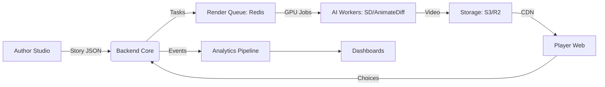
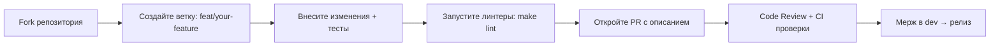

# 🎬 AI Interactive Story Engine

[](LICENSE)
[](../../tree/dev)
[](https://python.org)
[](https://nodejs.org)
[](https://discord.gg/your-invite)

> 🚀 **Open-source платформа для создания интерактивных видео-историй с генерацией контента на базе нейросетей.**  
> Авторы создают нелинейные сценарии через визуальный конструктор, игроки проходят истории с выбором вариантов, а ИИ генерирует видео с сохранением консистентности персонажей.

[Демо](#) • [Документация](./docs/) • [Roadmap](./ROADMAP.md) • [Обсуждение](../../discussions)

---

## ✨ Ключевые возможности

### 🎭 Для игроков
| Фича | Описание |
|------|----------|
| **Бесшовный плеер** | Двойной буфер + HLS-стриминг = переключение сцен без задержек |
| **4 варианта выбора** | 2 базовых (бесплатно), 1 премиум (реклама/валюта), 1 эксклюзив (подписка) |
| **Консистентные персонажи** | Лицо и одежда героя не меняются между сценами благодаря технологии «Цифровой ДНК» |
| **Офлайн-режим** | PWA-поддержка: кэширование пройденных сцен для игры без интернета |

### ✍️ Для авторов
| Фича | Описание |
|------|----------|
| **Node-based редактор** | Визуальное программирование сюжета: перетаскивайте сцены, настраивайте развилки |
| **AI Copilot** | Помощник по промптам: авто-расширение описаний, проверка на конфликты, стилевые пресеты |
| **Прогноз монетизации** | Тепловая карта доходности прямо в редакторе, советы по оптимизации |
| **Экспорт в 1 клик** | Сборка проекта под itch.io, Яндекс.Игры, VK Play, GitHub Pages |

### ⚙️ Для разработчиков
| Фича | Описание |
|------|----------|
| **Модульная архитектура** | Плагин-система для подключения своих AI-моделей, платежных шлюзов, аналитики |
| **Горизонтальное масштабирование** | Очередь задач на Redis + Kubernetes: от 1 до 1000+ авторов без переписывания кода |
| **Защита контента** | Обфускация, шифрование сценариев, integrity check, «фейковые ветки» для пиратов |
| **Полная аналитика** | Event-driven сбор метрик, вебхуки, дашборды для авторов и админов |

---

## 🏗️ Архитектура



### Технологический стек

| Слой | Технологии |
|------|-----------|
| **Фронтенд** | React 18, TypeScript, Phaser.js (мини-игры), HLS.js, Vite |
| **Бэкенд** | Python 3.11, FastAPI, Celery/BullMQ, Redis, PostgreSQL |
| **AI/ML** | Stable Diffusion XL, AnimateDiff, IP-Adapter, ControlNet, LoRA |
| **Инфраструктура** | Docker, Kubernetes, Cloudflare R2, Prometheus/Grafana |
| **CI/CD** | GitHub Actions, ArgoCD, Trivy (security scan) |

---

## 🚀 Быстрый старт

### Предварительные требования
- Docker & Docker Compose
- Node.js 18+ и Python 3.10+ (для локальной разработки)
- API-ключи: [Stability AI](https://platform.stability.ai/), [Cloudflare R2](https://www.cloudflare.com/developer-platform/r2/) (опционально для старта)

### Запуск через Docker (рекомендуется)

```bash
# 1. Клонируйте репозиторий
git clone https://github.com/your-org/ai-story-engine.git
cd ai-story-engine

# 2. Скопируйте конфиг
cp .env.example .env
# Отредактируйте .env: укажите API-ключи, настройки БД

# 3. Запустите стек
docker compose up -d

# 4. Примените миграции
docker compose exec backend python manage.py migrate

# 5. Готово! Откройте в браузере:
# 👉 Авторский конструктор: http://localhost:3000/studio
# 👉 Игровой плеер: http://localhost:3000/play
# 👉 API документация: http://localhost:8000/docs
```

### Локальная разработка

```bash
# Бэкенд
cd backend
python -m venv venv
source venv/bin/activate  # Windows: venv\Scripts\activate
pip install -r requirements-dev.txt
uvicorn main:app --reload

# Фронтенд
cd frontend
npm install
npm run dev

# Воркер рендеринга (опционально, требует GPU)
cd worker
pip install -r requirements.txt
# Для тестов без GPU используйте mock-режим:
export MOCK_RENDER=1
celery -A tasks worker --loglevel=info
```

> 💡 **Совет**: Для первого запуска без GPU установите `MOCK_RENDER=1` в `.env` — видео будут заменяться на заглушки, но вся бизнес-логика будет работать.

---

## ⚙️ Конфигурация

Основные переменные окружения (`.env`):

```ini
# === AI / Генерация ===
STABILITY_API_KEY=sk-...
DEFAULT_MODEL=stable-video-diffusion-img2vid-xt
FACE_CONSISTENCY_THRESHOLD=0.75

# === Хранение ===
STORAGE_PROVIDER=r2  # s3 | minio | r2 | local
R2_ACCOUNT_ID=...
R2_ACCESS_KEY=...
R2_SECRET_KEY=...
R2_BUCKET=ai-story-videos

# === Очереди ===
REDIS_URL=redis://localhost:6379/0
QUEUE_PRIORITY_FREE=1
QUEUE_PRIORITY_PREMIUM=5
QUEUE_PRIORITY_VIP=10

# === Безопасность ===
JWT_SECRET=change-me-in-production
ENCRYPTION_KEY=32-byte-key-for-story-json
ALLOWED_ORIGINS=https://your-domain.com

# === Монетизация ===
CURRENCY_NAME=coins
PRICE_VARIANT3=100
SUBSCRIPTION_MONTHLY_PRICE=4.99
AD_REWARD_AMOUNT=50
```

Полный список переменных: [`docs/ENV_REFERENCE.md`](./docs/ENV_REFERENCE.md)

---

## 📦 Структура проекта

```
ai-story-engine/
├── backend/                 # FastAPI + Celery
│   ├── api/                # REST endpoints
│   ├── core/               # Config, security, deps
│   ├── services/           # AI, storage, queue logic
│   ├── models/             # SQLAlchemy ORM
│   └── tests/              # Pytest suite
├── frontend/               # React + TypeScript
│   ├── src/
│   │   ├── components/     # UI: Player, Studio, Buttons
│   │   ├── hooks/          # Custom React hooks
│   │   ├── services/       # API client, WebSocket
│   │   └── utils/          # Helpers, types
│   └── public/             # Static assets
├── worker/                 # AI render workers
│   ├── pipelines/          # SDXL, AnimateDiff, IP-Adapter
│   ├── consistency/        # FaceID, embedding logic
│   └── mocks/              # Заглушки для тестов без GPU
├── docs/                   # Документация
│   ├── api/                # OpenAPI specs
│   ├── architecture/       # ADRs, диаграммы
│   └── guides/             # Гайды для авторов и разработчиков
├── docker/                 # Dockerfile, compose configs
├── scripts/                # Утилиты: миграции, деплой, бэкапы
├── .github/                # Workflows, issue templates
├── LICENSE
├── README.md
└── ROADMAP.md
```

---

## 🤝 Как внести вклад

Мы приветствуем вклад сообщества! 🎉

### 🔹 Начните с обсуждения
1. Проверьте [открытые Issues](../../issues) и [Discussions](../../discussions)
2. Если баг/фича не описаны — создайте новый Issue с шаблоном
3. Обсудите подход с мейнтейнерами **до** написания кода

### 🔹 Процесс Pull Request


### 🔹 Стандарты кода
- **Python**: Black + isort + Flake8, type hints обязательны
- **TypeScript**: ESLint + Prettier, строгий режим `tsconfig.json`
- **Коммиты**: [Conventional Commits](https://www.conventionalcommits.org/)
- **Тесты**: Покрытие >80% для новой бизнес-логики

### 🔹 Помощь без кода
- 🌐 Перевод документации (i18n)
- 🎨 Дизайн-система, иконки, UI-улучшения
- 📚 Написание гайдов, туториалов, примеров историй
- 🐛 Тестирование, репорты багов, UX-фидбек

📖 Подробнее: [`CONTRIBUTING.md`](./CONTRIBUTING.md)

---

## 🗺️ Roadmap

Ключевые вехи развития проекта:

| Квартал | Цель | Статус |
|---------|------|--------|
| **Q3 2024** | MVP: ядро генерации + плеер + базовый конструктор | 🟡 В работе |
| **Q4 2024** | Монетизация, аналитика, публичный бета-запуск | ⚪ Запланировано |
| **Q1 2025** | Оптимизация (LoRA, кэширование), мобильная адаптация | ⚪ Запланировано |
| **Q2 2025** | Маркетплейс ассетов, мульти-язычность, B2B-инструменты | ⚪ Идеи |

🔗 Полная дорожная карта: [`ROADMAP.md`](./ROADMAP.md)

---

## 📄 Лицензия

Проект распространяется под лицензией **MIT** — используйте, модифицируйте, распространяйте свободно.

```text
MIT License

Copyright (c) 2024 AI Story Engine Contributors

Permission is hereby granted, free of charge, to any person obtaining a copy
of this software and associated documentation files (the "Software"), to deal
in the Software without restriction, including without limitation the rights
to use, copy, modify, merge, publish, distribute, sublicense, and/or sell
copies of the Software, and to permit persons to whom the Software is
furnished to do so, subject to the following conditions:

The above copyright notice and this permission notice shall be included in all
copies or substantial portions of the Software.

THE SOFTWARE IS PROVIDED "AS IS", WITHOUT WARRANTY OF ANY KIND...
```

> ⚠️ **Важно**: Лицензия на **сгенерированный контент** (видео, изображения) зависит от условий используемых AI-моделей (Stability AI, etc.). Проверьте лицензии перед коммерческим использованием.

---

## 🙏 Благодарности

Этот проект был бы невозможен без открытого сообщества:

- 🤗 [Hugging Face](https://huggingface.co/) — модели и датасеты
- 🎨 [Stability AI](https://stability.ai/) — Stable Diffusion, SVD
- ⚡ [ComfyUI](https://github.com/comfyanonymous/ComfyUI) — вдохновение для пайплайнов
- 🧱 [React Flow](https://reactflow.dev/) — основа нашего node-редактора
- 👥 Всем контрибьюторам и ранним тестерам — спасибо за фидбек!

---

## 📬 Контакты

- 💬 **Чат сообщества**: [Discord](https://discord.gg/your-invite)
- 🐛 **Баги и фичи**: [GitHub Issues](../../issues)
- ✉️ **По вопросам партнёрства**: opensource@aistory.engine

---

> ⭐ **Понравился проект?** Поставьте звезду — это помогает нам развиваться и привлекать новых контрибьюторов!

```bash
# Быстрая ссылка для шеринга:
echo "🚀 Проверите открытый движок для AI-историй: $(pwd | sed 's/\/README.md$//')"
```

---

🔗 *Этот README автоматически обновляется при релизах. Последняя синхронизация: `{{ date }}`*
