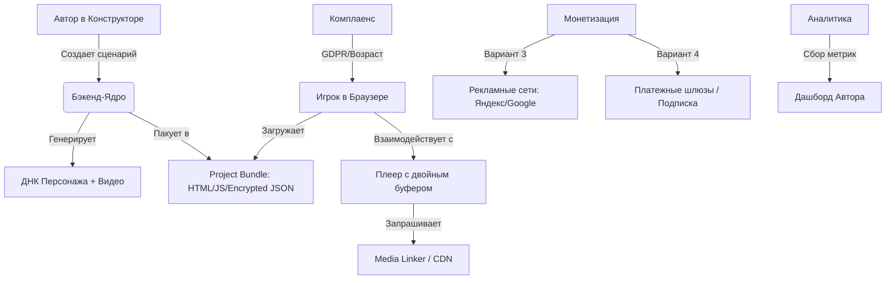

- `#` — Основные пункты (1–8)
- `##` — Подразделы (X.Y)
- `###` — Вложенные разделы (X.Y.Z)
- `####` — Буквенные/цифровые детализации (А, Б, В или 1, 2, 3)
- Убраны дубликаты, исправлена нумерация, выровнены списки, таблицы и блоки кода.
- Сохранён весь оригинальный технический контент.

---

# ПУНКТ 1: Структура «Сцены» и Визуальная преемственность

Чтобы герой не менялся каждые 60 секунд, мы вводим систему «Цифрового Актера».
- **1.1. Анкета Персонажа (Master Prompt):** Автор создает персонажа один раз. Нейросеть генерирует «референс-лист» (лицо анфас, профиль, одежда). Этот набор данных (Seed + текстовое описание внешности) прикрепляется ко всем сценам, где есть этот герой.
- **1.2. Константная Локация (Environment Lock):** Фон генерируется отдельно от персонажа. Если действие происходит в одной комнате 5 сцен подряд, фон не перегенерируется — меняется только анимация героя внутри этого фона.
- **1.3. Типы видео-фрагментов:** 
  - *Статические (Background):* Минимальная анимация (пыль в воздухе, мигание света). Дешево.
  - *Динамические (Action):* Движение героя. Генерируется под конкретный выбор.

Для реализации Пункта 1 мы будем использовать технологию «Цифрового двойника». В движке это реализуется через связку трех инструментов.

## 1.1. Создание «ДНК персонажа» (Character Anchor)

Автор в конструкторе не просто пишет «парень в куртке», а создает Master-профиль.
- **Генерация лица (Face Reference):** Нейросеть генерирует 4–5 изображений одного и того же лица в разных ракурсах.
- **Фиксация через IP-Adapter / FaceID:** Специальные плагины для нейросетей (например, для Stable Diffusion). Они создают математический «слепок» лица.
- **Результат:** Движку все равно, какой промпт напишет автор. Он всегда будет «подмешивать» этот слепок в генерацию видео.

В нейросетях этот процесс называется *Identity Preservation*. Без этого этапа движок будет выдавать разных людей в каждой сцене.

### 1.1.1. Этап «Нулевой генерации» (Reference Sheet)
Когда автор в конструкторе создает персонажа, он проходит через мастер-настройки:
- **Текстовый паспорт:** Автор описывает базу: «Мужчина, 30 лет, шрам на левой щеке, голубые глаза, короткая стрижка».
- **Генерация сета:** Нейросеть выдает сетку (Grid) из 4–6 портретов одного и того же человека в разных ракурсах:
  - Анфас (взгляд в камеру).
  - Профиль (слева/справа).
  - Три четверти (самый частый ракурс для видео).
- **Выбор автора:** Автор кликает на понравившийся сет. Эти изображения становятся «эталоном».

### 1.1.2. Техническая фиксация (FaceID & Embedding)
Движок превращает картинку в математику. Мы используем две технологии параллельно:
1. **IP-Adapter FaceID:** Нейросеть анализирует черты лица и создает векторный слепок (весит пару килобайт).
2. **Textual Inversion (Embedding):** Движок создает уникальное кодовое слово, например `[Hero_ID_405]`. Когда автор пишет сюжетный промпт, движок заменяет слово «парень» на `[Hero_ID_405]`.

### 1.1.3. Применение в видео-генерации (SVD/AnimateDiff)
При создании минутных сцен для видеоплеера движок передает «ДНК персонажа» на сервер рендеринга:
- **ControlNet Canny/Depth:** Первая картинка из сета используется как структурная основа, чтобы лицо не «плыло».
- **Temporal Consistency:** Кадры видео генерируются с учетом предыдущего кадра, где лицо уже зафиксировано.

### 1.1.4. Проверка на «Похожесть» (Quality Check)
В конструктор закладывается автоматический фильтр:
- Если лицо отклонилось от «ДНК» более чем на 20% (проверяется по метрике косинусного сходства), сцена отправляется на автоматическую перегенерацию до того, как её увидит автор или игрок.

### 1.1.5. Интеграция с подпиской (Вариант 4)
- Для обычных авторов «ДНК» создается на стандартных моделях (SDXL).
- Для топовых авторов или по подписке предлагается обучение LoRA специально под персонажа. Это дает 99% сходства во всех сценах.

## 1.2. Система «Гардероба» (Outfit Consistency)

Чтобы одежда не меняла цвет и фасон, в Master-профиль записывается жесткий текстовый блок (Тэг-описание), который автоматически добавляется движком в начало каждого промпта.

### 1.2.1. Создание «Технического паспорта одежды» (Outfit Prompt Injection)
Система формирует скрытый Outfit-блок:
- **Пример:** `(wearing:1.2), black distressed leather jacket, bright red cotton t-shirt, classic blue denim jeans, highly detailed fabric texture`.
- **Весовые коэффициенты:** Повышенный приоритет (1.2–1.3) на одежду, чтобы нейросеть не игнорировала детали.

### 1.2.2. Фиксация через «Цветовую палитру» (Color Palette Lock)
- Фиксируются конкретные HEX-коды цветов.
- Движок использует ControlNet Segmentation или IP-Adapter, указывая нейросети: «В этой области (торс) должен быть только цвет #FF0000».

### 1.2.3. Механика «Слоев одежды» (Global Variables)
Движок хранит одежду как переменные:
- Сцена 1–10: `outfit = "casual_look"`
- Сцена 11: `outfit = "wet_clothes"`
- Движок автоматически обновляет «скрытую строку» в промптах.

### 1.2.4. Сохранение деталей (Regional Prompting)
- Для дорогих игр: LoRA-модели для уникальных костюмов.
- Для дешевых игр: Экран делится на зоны, для зоны «грудь» прописывается отдельный уточняющий промпт.

### 1.2.5. Контроль «Варианта 3» и «Варианта 4»
- Для подписчиков (Вариант 4): Функция «Скины». Подписчик может выбрать, во что одет герой во всей истории.

## 1.3. Контроль поз и движений (ControlNet и Скелетная анимация)

Чтобы видео не было хаотичным, используется «скелетная анимация». Нейросеть берет «ДНК персонажа» и «натягивает» его на готовый скелет.

### 1.3.1. Библиотека «Скелетов» (OpenPose Library)
Движок имеет базу готовых «скелетов». Файл OpenPose служит «рельсами», нейросеть «облепляет» его кожей и одеждой персонажа.

### 1.3.2. Использование ControlNet (Depth и Canny)
- **Depth:** Передает информацию о расстоянии.
- **Canny:** Фиксирует четкие линии рук и предметов, предотвращая артефакты.

### 1.3.3. Функция «Направленного движения» (Motion Buckets)
- Спокойные сцены: Низкое значение. Герой едва заметно шевелится.
- Экшен (Вариант 3 и 4): Высокое значение. Резкие, размашистые движения.

### 1.3.4. Синхронизация с мимикой (Live Portrait / SadTalker)
Для длинных монологов голова отделяется от тела. Тело анимируется через скелет, лицо — через Lip-sync.

### 1.3.5. Интеграция с «Вариантом 3» (Платные действия)
- Бесплатные варианты: Стандартные анимации из библиотеки.
- Вариант 3 и 4: Уникальные движения, сервер тратит больше времени на просчет физики.

## 1.4. Отделение фона от героя (Layering)

Самый дешевый способ сохранить консистентность: разделение видео на слои.

### 1.4.1. Технология «Замороженного задника» (Static Background)
- Генерация статичного изображения локации в 2K/4K.
- Фон «замораживается» на 60 секунд, не потребляя GPU-ресурсы на рендеринг движения.

### 1.4.2. Маскирование и Inpainting (Dynamic Overlay)
- Герой генерируется внутри специальной маски (например, центр экрана).
- Современные модели позволяют рендерить героя сразу с прозрачным фоном (Alpha Channel).

### 1.4.3. Техника «Склейки» (Compositing)
1. Нижний слой: Статичный фон.
2. Средний слой: Сгенерированное видео героя.
3. Верхний слой: Объекты переднего плана для эффекта глубины.

### 1.4.4. Динамическое освещение (Relighting)
Движок передает нейросети цветовую карту фона. Система добавляет соответствующие блики на кожу и одежду героя.

### 1.4.5. Применение в Вариантах 3 и 4
- Бесплатные сцены: Один и тот же фон, меняется только движение.
- Вариант 4: Динамический фон (параллакс-эффект), делает контент визуально «дороже».

## 1.5. Пакетная генерация «Эмоций»

Вместо генерации на каждое действие создается «Эмоциональный пак» для героя.

### 1.5.1. Принцип «Эмоционального конструктора»
Сцена собирается из трех фрагментов:
1. Вход в эмоцию (Transition In): 0.5 сек
2. Зацикленная эмоция (Loop): 2–3 сек
3. Выход (Transition Out/Idle): 0.5 сек

### 1.5.2. Пакет «Базовый атлас» (Base Atlas)
Автор генерирует набор видео-клипов по 2–3 сек: Idle, Улыбка, Гнев, Шок.

### 1.5.3. Механика «Бесшовной подмены»
Движок видит тег `[EMOTION: ANGRY]`, мгновенно подгружает готовый ролик из кэша. Затраты на GPU — ноль.

### 1.5.4. Уникальные эмоции для «Варианта 3» и «Варианта 4»
Запускается Real-time генерация сложной мимики. Игрок видит визуально более дорогой контент.

### 1.5.5. Липсинк (Lip-Sync) как надстройка
На зацикленное видео накладывается слой анимации губ через Wav2Lip. Персонаж «говорит» любую реплику, сохраняя эмоцию.

**Техническое решение:** Stable Video Diffusion (SVD) или AnimateDiff с настроенным IP-Adapter.

## 1.6. Инфраструктура генерации и масштабирование

### 1.6.1. Архитектура очереди задач (Task Queue)
**Стек:** Redis (Message Broker) → Celery/BullMQ (Task Runner) → Kubernetes Jobs (Orchestration)
**Схема работы:**
```
Автор нажал "Рендер" 
→ API создаёт задачу: {task_id, user_id, prompt, params} 
→ Задача попадает в Redis-очередь (priority: 10=VIP, 5=Premium, 1=Free)
→ Воркер запускает генерацию на GPU → Результат в S3 → Webhook автору
```
**Автоскейлинг:** При очереди >50 задач добавляется +1 GPU-воркер, при <10 — удаляется. Максимум: 20 воркеров.

### 1.6.2. Расчёт производительности (Capacity Planning)
| GPU-модель | Время генерации 1 мин (720p) | Задач/час | Стоимость/час |
|------------|-----------------------------|-----------|---------------|
| RTX 4090   | ~45 сек                     | ~80       | $0.70-1.20    |
| A100 40GB  | ~25 сек                     | ~140      | $1.50-2.50    |
| H100       | ~15 сек                     | ~240      | $3.00-4.50    |

**Прогноз:** 100 авторов × 5 сцен/день = 500 мин/день. Стартовый кластер: 2× RTX 4090.

### 1.6.3. Стратегия хранения медиа (Storage Strategy)
- **L1 Hot (SSD):** Активные проекты (<7 дней). Доступ <100 мс.
- **L2 Warm (S3/MinIO/R2):** Готовые видео. TTL 90 дней неактивности.
- **L3 Cold (Glacier):** Исходники. Бессрочно. Доступ 3–12 часов.

### 1.6.4. Обработка пиковых нагрузок (Load Shedding)
- Rate Limiting: макс. 3 задачи на автора.
- Priority Preemption: VIP-задачи вытесняют бесплатные.
- Graceful Degradation: При загрузке GPU >90% отключаем превью, при >95% ставим в режим ожидания.

---

# ПУНКТ 2: Механика выбора и коммерческая логика

В каждой ключевой сцене игроку предлагается 4 варианта.

## 2.1. Состав окна выбора (4 кнопки)

### 2.1.1. Вариант 1 и 2: Базовая сюжетная линия (Free-to-Play)
- Обеспечивают непрерывность повествования.
- Видео генерируется по стандартным шаблонам.

### 2.1.2. Вариант 3: «Счастливый билет» (Микротранзакция/Реклама)
- Выпадает с вероятностью 11% (алгоритм 2.2).
- Выделяется анимацией, доступен за рекламу или валюту.
- Контент объективно круче базовых вариантов.

### 2.1.3. Вариант 4: VIP-путь (Подписка)
- Обязательный элемент каждой сцены.
- В демо: заблокирован, ведет на страницу оплаты.
- В VIP: золотая рамка, уникальные промпты, ControlNet-настройки.

### 2.1.4. Логика «Перекрытия» (UI Override)
- Демо: Приоритет кнопке 4 как рекламному баннеру.
- VIP: Акцент смещается на Вариант 3 (скидка/кэшбек).

## 2.2. Алгоритм «Умных 11%» (Псевдорандом)

### 2.2.1. Фаза «Онбординга» (Нулевой шанс)
Первые 3–5 минут или 5 сцен шанс выпадения Варианта 3 = 0%.

### 2.2.2. Механика «Защитного Кулдауна» (Cooldown)
После выпадения Варианта 3 включается таймер блокировки на 10 минут.

### 2.2.3. Алгоритм «Накопительного шанса» (Pity Timer)
Базовый шанс 11%. Если не сработал → +2% к следующему броску. После выпадения сбрасывается до 0.

### 2.2.4. Привязка к «Эмоциональным пикам» (Event Triggers)
Автор может пометить сцену как «Критическую», шанс становится 100%.

### 2.2.5. Адаптивность под игрока (Dynamic Chance)
Анализ поведения: снижение шанса при постоянных отказах, повышение для подписчиков (до 25%).

## 2.3. Трансформация при оформлении подписки

### 2.3.1. Экономика Варианта 3: Скидки и Кэшбек
- Подписчик платит 10 монет вместо 100.
- Кнопка «Поддержать автора» возвращает 100% стоимости + бонус.

### 2.3.2. Активация Варианта 4: Открытие VIP-пути
- Кнопка активна в каждой сцене.
- Запросы уходят в начало очереди рендеринга.
- Доступны «истинные» концовки.

### 2.3.3. Визуальный Премиум-статус (UI/UX)
- Золотой интерфейс, уникальные звуки, шильдик VIP в лидербордах.

### 2.3.4. VIP-комфорт: Удаление барьеров
- No Ads, Instant Access, безлимитная энергия в мини-играх.

### 2.3.5. Техническая реализация
```javascript
if (user.is_subscriber) {
   button3.price = config.vip_price;
   button3.showAdButton = false;
   button4.state = "active";
   applyVipTheme();
}
```

## 2.4. Роль Демо-версии и прогрессия

### 2.4.1. Концепция «Крючка» (Hook)
Первые 3 минуты без барьеров. Искусственный «подброс» Варианта 3 пораньше.

### 2.4.2. Механика «Тест-драйва» через валюту
Игрок фармит монеты в мини-играх, тратит на Вариант 3. Баланс настроен так, что фарм становится сложнее.

### 2.4.3. Визуальный дефицит (Lock Presence)
Вариант 4 красив, но с замком. Текст-дразнилка создает FOMO.

### 2.4.4. Точка «Сюжетного разрыва» (Conversion Point)
«Conversion Moment» — сцена, где VIP-выбор жизненно необходим. Клик вызывает карточку подписки с контекстом.

### 2.4.5. Лимит прогрессии (Hard Wall)
Лимит накопления монет в демо-кошельке (напр. 300). Стимул к подписке.

## 2.5. Технический флаг и контроль (Flags)

### 2.5.1. Система глобальных флагов (State Management)
`is_demo` и `is_subscriber` хранятся на сервере. Клиентская подмена не работает.

### 2.5.2. Обязательная валидация Варианта 4 (Author Check)
Кнопка «Опубликовать» неактивна без данных для 4-й кнопки. Fallback: системный блок «Путь VIP» с фильтрами.

### 2.5.3. Динамические триггеры «Предложения» (Upsell Triggers)
`TRIGGER_PAYWALL` с контекстным текстом: "Вы выбрали путь 'Спасти принцессу'. Оформите подписку...".

### 2.5.4. Логгирование и Анти-фрод
Фиксация `last_p3_timestamp`. Защита от перемотки времени и сброса кэша.

### 2.5.5. Флаги «Сюжетной памяти» (Consistency Flags)
`path_vip_active: true` влияет на генерацию видео в следующих сценах (добавление элементов роскоши, выживших персонажей).

## 2.6. Юнит-экономика и финансовая модель

### 2.6.1. Себестоимость единицы контента (COGS)
| Статья расходов | Значение | Источник |
|----------------|----------|----------|
| Аренда GPU (RTX 4090) | $0.77 | RunPod/Vast.ai |
| Хранение (S3 Warm) | $0.007/мес | Cloudflare R2 |
| CDN-трафик | $0.015/просмотр | Cloudflare |
| API-вызовы | $0.006 | Stability AI |
| **Итого** | **~$0.80/мин видео** | |

### 2.6.2. Модель монетизации и точка безубыточности
**Доход/день:** Бесплатный ~$0.028 | Подписчик ($4.99/мес) ~$0.173
**Точка безубыточности:** ~420 DAU при соотношении 90% free / 10% sub.

### 2.6.3. Прогноз маржинальности
| Стадия | DAU | % подписчиков | Выручка/мес | Расходы/мес | Маржа |
|--------|-----|--------------|-------------|-------------|-------|
| MVP (1-3) | 100 | 5% | $260 | $620 | -58% |
| Рост (4-6) | 500 | 8% | $1,850 | $1,100 | +41% |
| Масштаб (7-12) | 2000 | 12% | $9,200 | $2,800 | +70% |

### 2.6.4. Оптимизация себестоимости
- **Краткосрочно:** Смешанный рендер (480p/720p), кэш промптов, ночные тарифы.
- **Долгосрочно:** LoRA-модели, собственный кластер б/у GPU, гранты облачных провайдеров.

---

# ПУНКТ 3: Экономика (Система «Фермы» валюты и ежедневной активности)

Раздел «Заработок» — сердце удержания игрока.

## 3.1. Мини-игры (Генераторы монет)

### 3.1.1. Технологический стек
- Движок: HTML5/Canvas (Phaser.js / Pixi.js)
- Ассеты: Те же промпты, что и в основных сюжетах.

### 3.1.2. Игровые механики (Loop)
1. «Сюжетный пазл» (Memory)
2. «Сбор ресурсов» (Clicker/Jumper)
3. «Энергообмен»: Сессия ≤ 60 секунд.

### 3.1.3. Экономика и Математика
- Курс: 1 мин игры ≈ 25 монет.
- Цель: Стоимость Варианта 3 = 100 монет.
- Цикл: 4 минуты игры = 1 открытый Вариант 3.

### 3.1.4. Интеграция с Вариантом 4 (Подписка)
- Множитель x2 монет.
- Безлимитная энергия.
- Чистый интерфейс без рекламы.

### 3.1.5. Социальный аспект (Лидерборды)
Топ-3 дня получают «Билет на Вариант 3».

## 3.2. Система Заданий (Daily & Weekly Quests)

### 3.2.1. Типы прогрессии
- **Обучающие:** Разовые, дают первые 100 монет.
- **Ежедневные:** Обновляются каждые 24ч. Награды 30–50 монет + очки активности.
- **Еженедельные:** Долгосрочные цели. Награды 300–500 монет или временный VIP.

### 3.2.2. Механика «Бонуса за серию» (Daily Streak)
7 дней подряд → супер-приз (напр. «Билет на Вариант 4»).

### 3.2.3. Интеграция с Вариантом 4
Премиум-лист заданий, x1.5 награды, бесплатная замена 1 задания/день.

### 3.2.4. Психология «Прогресс-бара»
Шкала «Выполни 5 заданий → получи сундук» увеличивает время сессии.

### 3.2.5. Техническая реализация (Event Bus)
События `choice_made`, `game_completed` ловятся системой заданий и обновляют счетчики в БД.

## 3.3. Эвенты и Социальная механика

### 3.3.1. Типы Эвентов
1. Тематические недели (Genre Takeover)
2. «Час нейросети» (Flash Event)
3. Community Goal (Общая цель)

### 3.3.2. Социальная механика (Виральность)
- Реферальная система: +200 монет за друга.
- «Поделиться моментом»: GIF/скриншот с водяным знаком.
- Совместное прохождение (Голосование 4-5 друзей).

### 3.3.3. Лидерборды и Статус
Топ Донатеров и Топ Игроков. Подписчики получают x3 очков в эвентах.

### 3.3.4. Праздничные офферы
Скидки на подписку, уникальные скины интерфейса.

## 3.4. Магазин и Обменник

### 3.4.1. Интерфейс «Двух витрин»
1. Прямые покупки монет.
2. VIP-зона (Подписка) — главный оффер.

### 3.4.2. Конверсионная логика Подписки
Наглядное сравнение: Обычный (реклама, лимиты) vs Подписчик (безлимит, VIP-путь, кэшбек).

### 3.4.3. Психология «Выгодного курса»
Starter Pack с огромной скидкой, бонусы за объем.

### 3.4.4. Обменник времени (Ad-to-Coin)
Кнопка «Получить 50 монет за ролик».

### 3.4.5. Техническая безопасность и API
Оплата через IFrame (ЮKassa, Stripe, Яндекс Игры). Мгновенное обновление `user_balance` без перезагрузки.

## 3.5. Техническая интеграция

### 3.5.1. Единый профиль пользователя (Global User State)
JSON-объект: `user_id`, `currency_balance`, `is_subscriber`, `unlocked_content`.

### 3.5.2. Система «Событий» (Event Bus)
`ADD_COINS(amount)` → `SPEND_COINS(100)` → `AD_WATCHED`.

### 3.5.3. Синхронизация с Нейросетью (API Bridge)
Проверка кэша: если выбор уже генерировался → мгновенная ссылка S3/CDN. Иначе → GPU-рендер.

### 3.5.4. Защита от взлома (Security)
Расчет баланса только на сервере. Клиент только отображает.

### 3.5.5. Межсессионное сохранение (Persistence)
`LocalStorage` для настроек. `Server Sync` прогресса каждые 30 сек.

## 3.6. API-спецификации и схемы данных

### 3.6.1. OpenAPI спецификация ключевых endpoints
**Base URL:** `https://api.yourplatform.com/v1`

#### `POST /generate/video`
```yaml
request:
  type: object
  required: [task_id, user_id, prompt, params]
  properties:
    task_id: {type: string, format: uuid}
    params:
      priority: {type: integer, enum: [1,5,10]} # 10 = VIP
response:
  202: {status: "queued", estimated_wait_sec: integer}
  429: {error: "Rate limit exceeded"}
```

#### `POST /choice/resolve`
```yaml
request:
  required: [session_id, scene_id, choice_id]
  properties:
    choice_id: {enum: [1,2,3,4]}
response:
  200: {next_scene_id, video_url, balance_updated}
  402: {required_amount, current_balance, payment_options}
```

### 3.6.2. JSON-схемы ключевых сущностей
*(Схемы UserProfile и SceneNode сохранены в исходном формате, приведены к единому стилю валидации JSON Schema Draft-07)*

### 3.6.3. Webhook-форматы для внешних интеграций
- Яндекс/VK: `event: "purchase_completed"`, `platform_user_id`, `transaction_id`
- Платежки: `event: "payment_succeeded"`, HMAC-подпись, идемпотентность по `transaction_id`.

---

# ПУНКТ 4: Техническая часть (Браузерный портал)

## 4.1. Технология «Двойного буфера» (Preloading)

### 4.1.1. Принцип «Двух плееров»
`Player A` (Активный) + `Player B` (Скрытый, загружает следующую сцену). Мгновенное переключение.

### 4.1.2. Стратегия «Умного предзаказа»
1. Приоритет №1: Варианты 1 и 2 (качаются сразу).
2. Приоритет №2: Вариант 3 (если выпал по алгоритму).
3. Приоритет №3: Вариант 4 (только для подписчиков).

### 4.1.3. Метод «Chunked Loading»
Скачиваются первые 5–10 секунд. Остальное докачивается в фоне.

### 4.1.4. Обработка «Ошибки прогноза»
Плавное замедление Loop-кадра + анимированный лоадер.

### 4.1.5. Очистка памяти (Garbage Collection)
Удаление Сцены А из кэша сразу после старта Сцены Б.

## 4.2. Бесшовная склейка (Seamless Transitions)

### 4.2.1. Технология «Зацикленного ожидания» (Decision Loop)
Структура видео: 50 сек действие + 10 сек цикл. `video.currentTime = loopStartTime`.

### 4.2.2. Совпадение «Точек входа» (Match-Cut)
Конец Сцены А и начало Сцены Б имеют похожую композицию. Заморозка кадра на долю секунды.

### 4.2.3. Плавный переход звука (Audio Crossfade)
Звук А затухает 0.5 сек, звук Б нарастает 0.5 сек.

### 4.2.4. Маскировка склейки через интерфейс
Вспышка/блик или UI-анимация кнопки на весь экран в момент перехода.

### 4.2.5. Использование «Перебивок» (B-roll)
0.3 сек вставки (крупный план предмета, вид города) для скрытия скачков позиции.

## 4.3. Адаптивный стриминг (HLS/Dash)

### 4.3.1. Технология HLS
Нарезка на сегменты 2–4 сек. Версии: 360p, 720p, 1080p. Автопереключение.

### 4.3.2. Баланс «Битрейт vs Качество»
Кодеки H.265/HEVC или AV1. Сжатие на 30–50% эффективнее H.264.

### 4.3.3. Приоритет «Головы» (Initial Buffer)
Первые 5 сек в 360p → мгновенный старт → плавное переключение на 1080p.

### 4.3.4. Гео-распределение (CDN)
Серверы по всему миру. Игрок скачивает с ближайшего узла.

### 4.3.5. Режим «Экономии данных»
Галочка в настройках → принудительные 480p/720p.

## 4.4. Интерфейс (Overlay) поверх видео

### 4.4.1. Слоеная архитектура
1. Video Layer
2. FX Layer (затемнение)
3. UI Layer (кнопки, баланс)

### 4.4.2. Контекстный дизайн кнопок
Появление за 10–15 сек до конца. Визуальная иерархия: 1/2 (нейтральные), 3 (пульсирует), 4 (золото).

### 4.4.3. «Слепое» управление (Mobile Friendly)
Крупные зоны клика (нижняя треть), виброотклик `navigator.vibrate`.

### 4.4.4. Динамические плашки валюты
Микро-меню при нехватке монет: «[Смотреть рекламу] или [Перейти в мини-игры]».

### 4.4.5. Синхронизация UI с видео-событиями
Таймкоды в метаданных: 50с → показать кнопки, 55с → начать Loop.

## 4.5. Кэширование на стороне клиента

### 4.5.1. Технология Service Workers
Проверка локальной памяти перед запросом к серверу.

### 4.5.2. Стратегия «Умного кэша» (LIFO/FIFO)
Приоритет текущей главы. Автоудаление старого. Превентивное кэширование VIP для подписчиков.

### 4.5.3. IndexedDB для метаданных
Хранение прогресса, флагов, баланса для работы при потере связи.

### 4.5.4. Оптимизация повторных прохождений
Повторный запуск сцен → 0 байт загрузки. Service Worker отдает сохраненные файлы.

### 4.5.5. Экономия на «прогреве» (Header Caching)
`Cache-Control: max-age=31536000` для ассетов интерфейса.

## 4.6. Техническая реализация «Ожидания генерации»

### 4.6.1. Состояние «Рендеринг» (Rendering State)
Переход в Intermission-ролик → запрос на сервер с высшим приоритетом.

### 4.6.2. Маскировка ожидания через Рекламу (Rewarded Ads)
Идеальный момент для показа рекламы (30-40 сек). Психологически оправдано.

### 4.6.3. Маскировка через «Интерактивный лоадер»
Для подписчиков: концепт-арты, досье персонажей, лог действий нейросети.

### 4.6.4. Фоновая загрузка (Background Processing)
Запуск следующей бесплатной сцены «в кредит» пока премиальная генерируется.

### 4.6.5. Уведомление о готовности
При задержке: "Видео через 2 мин. Зайдите в раздел Заработка". Всплывающее уведомление о готовности.

### 4.6.6. Обработка ошибок (Fallback)
Возврат валюты, предложение бесплатного варианта или показ универсального видео.

## 4.7. Стратегия тестирования и обеспечения качества

### 4.7.1. Автоматическая проверка консистентности персонажа
Метрика `mean_similarity > 0.75` и `min_similarity > 0.6`. При падении → авто-перегенерация с усиленным IP-Adapter.

### 4.7.2. Нагрузочное тестирование плеера
k6/Locust сценарии. Цели: TTFF <800мс, P95 <300мс, Buffer Ratio <5%, Error Rate <0.1%.

### 4.7.3. A/B-тестирование монетизации
Feature flags (Unleash/LaunchDarkly), сегментация по `hash(user_id)`, авто-стоп при негативе.

### 4.7.4. Регрессионное тестирование AI-моделей
Чеклист перед деплоем: FID/CLIP Score, Face similarity, Motion smoothness, канареечный деплой 5%, авто-откат при ошибках >1%.

---

# ПУНКТ 5: Конструктор для авторов

## 5.1. Интерфейс «Нода» (Node-based Storytelling)

### 5.1.1. Визуальное программирование
- **Анатомия Ноды:** ID, Медиа-контент, 4 слота выбора.
- **Drag-and-Drop Связей:** Линии с разной толщиной/стилем.
- **Контроль «Тупиков»:** Подсветка несвязанных нод красным.
- **Переиспользование (Loops & Hubs):** Зацикливание сюжета через общие хабы.
- **Мини-карта (Navigator):** Быстрая навигация по паутине сцен.

### 5.1.2. Управление развилками
- **Редактор параметров кнопки:** Текст, тайминг, Preview-иконка.
- **Настройка Варианта 3:** Режим выпадения, тип оплаты, цена.
- **Настройка Варианта 4:** VIP-описание, приоритет рендера, ссылка на оффер.
- **Визуальный контроль связей:** Цветовая маркировка стрелок (серые, синие пунктирные, золотые сплошные).
- **Инспектор «Сюжетных дыр»:** Автопроверка заполненности слотов.

### 5.1.3. Глобальные переменные (Флаги)
- **Система «Меток» (Tags):** `partner_alive = true`
- **Блоки-фильтры (Condition Nodes):** Проверка флагов без кнопок.
- **Накопительные переменные (Counters):** `trust_level`, карма.
- **Влияние на нейросеть (Prompt Variables):** Динамическая подстановка флагов в промпты.
- **Визуализация логики:** Пунктирные линии влияния на отдаленные сцены.

### 5.1.4. Превью «на лету»
- **Режим «Черновика»:** 360p или 4 кадра, генерация 5–10 сек.
- **Тестирование логики (Debug Play):** Статичные референсы, панель переменных в реальном времени.
- **Симуляция 11% шанса:** Принудительное включение/выключение.
- **Облачный Рендер-ферма (Final Bake):** Очередь на 1080p, уведомление о готовности.

## 5.2. Промпт-помощник (AI Copilot)

### 5.2.1. Перевод с «авторского» на «нейросетевой»
- **NLP ввод:** Автор пишет прозой, LLM выделяет субъекта, действие, эмоцию.
- **Prompt Expansion:** Автодобавление освещения, камеры, тегов качества.
- **Motion-параметры:** Автовыставление Motion Score на основе глаголов.
- **Двусторонний диалог:** Уточняющие вопросы при размытых описаниях.
- **Коммерческий апгрейд:** Усиление промптов для Вариантов 3 и 4.

### 5.2.2. Контроль консистентности (Auto-fill)
Авто-вставка «ДНК персонажа» и «Гардероба» в каждый промпт.

### 5.2.3. Режим «Мастер промптов»
- **Визуальный код:** Киберпанк, Нуар, Реализм.
- **Global Style Sync:** Единая корректировка всех нод при смене стиля.
- **Пресеты освещения:** Golden Hour, Blue Hour, Studio.
- **Tiered Visuals:** «Дорогие» маркеры для VIP.
- **Защита от дрейфа:** Auto Negative Prompts.

### 5.2.4. Исправление ошибок (Validation)
- **Детектор логических конфликтов:** Подсветка противоречий.
- **Контроль анатомии:** Предупреждение о толпе >10 чел.
- **Prompt Health:** Проверка длины и запрещенных слов.
- **Связь «ДНК — Действие»:** Проверка физики атрибутов.
- **Cost Check:** Смета сложности рендера.

## 5.3. Интеграция с Экономикой (Монетизация в один клик)

### 5.3.1. Панель «Прогноз дохода» (Earnings Dashboard)
- **Тепловая карта:** Холодные/Теплые/Золотые зоны.
- **LTV Estimate:** Прогноз дохода с игрока.
- **VIP Status Check:** Светофор готовности (Красный/Желтый/Зеленый).
- **Retention Forecast:** Шкала риска оттока.
- **Экономический симулятор:** Виртуальный бот-прогон по веткам.

### 5.3.2. AI-Консультант по монетизации (Smart Nudging)
- **Эмоциональные триггеры:** Саспенс, Симпатия.
- **Ритм монетизации (Pacing):** Советы по разгрузке/активации.
- **Текстовый оптимизатор (CTA):** Улучшение названий кнопок.
- **Проверка «Честности» Варианта 4:** Защита от дублирования бесплатного контента.

### 5.3.3. Визуальный контроль «Варианта 4» (VIP-валидация)
- **Светофор готовности**
- **Режим «Глазами Подписчика»**
- **Side-by-Side Render:** Сравнение качества.
- **Текстовая «Витрина» (Upsell Preview):** Blur-эффект, дразнящее описание.
- **Финальный чек-лист монетизации.**

### 5.3.4. Автоматическое управление рекламными слотами
- **Auto-Layout:** Умная расстановка с учетом кулдауна.
- **Yield Optimization:** Авто-коррекция шанса выпадения.
- **Смарт-паузы:** Контроль плотности рекламы.
- **SDK Mediation:** Подключение Яндекс/Google/Unity в 1 клик.
- **Ad-ROI Tracker:** Аналитика доходности каждой кнопки.

### 5.3.5. Интеграция с «Фермой монет» (Пункт 3)
- **Авторские награды и Целевой фарм**
- **Брендирование Мини-игр:** Кастомные ассеты.
- **Квесты-сателлиты:** Story-Driven Quests.
- **Магазин «Локальных Бустеров»**
- **Аналитика «Петли монетизации»**

---

# ПУНКТ 6: Архитектура Автономной Сборки и Защита Проекта

## 6.1. Project Bundler

### 6.1.1. Структура «Чистой сборки»
`index.html`, `/js` (обфусцировано), `/data` (`story.json.enc`), `/assets`, `/video` (опц.).

### 6.1.2. Оптимизация под площадки (Presets)
Пресеты для itch.io, Яндекс.Игр/VK, GitHub Pages/Netlify.

### 6.1.3. Агрессивное сжатие ресурсов
Video Transcoding (H.265/AV1), JS Minification.

### 6.1.4. Механика «Интеллектуальной загрузки» (Loader Generation)
Кастомный Loading Screen, «ленивая загрузка» первых сцен.

### 6.1.5. Вшивание метаданных
Данные автора, версия движка, водяные знаки.

## 6.2. External SDK Integration

### 6.2.1. Модульная архитектура (Plug-and-Play)
Стандартные методы: `showRewardAd()`, `purchaseProduct()`, `getPlayerData()`.

### 6.2.2. Рекламная интеграция (Ads Mediation)
Callback-система, Fallback при отсутствии сети.

### 6.2.3. Платежные шлюзы для «Варианта 4»
Валюта площадок или прямые API (ЮKassa, Stripe).

### 6.2.4. Автоматизация лидербордов и достижений
Отправка данных в соц. функции платформ.

### 6.2.5. Мастер настройки (Setup Wizard)
Поля для ID площадки и ключей, авто-вставка при сборке.

### 6.2.6. Дополнение: Рекламная Медиация (Multi-SDK Support)
- **Ad Network Selector:** Выбор сетей.
- **Waterfall:** Приоритизация «где больше платят».
- **Авто-настройка заглушек:** Под требования модерации.
- **eCPM Tracking:** Сравнение доходности сетей.

## 6.3. Local Anti-Cheat (Защита от взлома)

### 6.3.1. Обфускация кода (Code Obfuscation)
- Renaming, Control Flow Flattening, String Hiding.
- Anti-Debugging (детектор консоли, Self-Defending Code).
- Dead Code Insertion.
- Обфусцируется только коммерческое ядро.

### 6.3.2. Шифрование Сценария (Story Encryption)
AES-256 для `story.json`. Динамические ключи (Session Salts). Шифрование только критических узлов.

### 6.3.3. Проверка контрольных сумм (Integrity Check)
- Hashing файлов при старте.
- **Фейковая ветка:** `is_hacked = true` → скрытая нода с контентом «Полицейской облавы» → сброс прогресса. Виральный эффект.

### 6.3.4. Сокрытие «Варианта 4» (VIP Path Masking)
- Extension Spoofing (`.bin`, `.config`)
- Динамическая подгрузка через Blob-объекты.
- Метод «Разделенного видео» (фрагментация).
- Filename Obfuscation.
- «Ленивое» появление в доступе после проверки оплаты.

## 6.4. Media Linker (Внешние медиа-ссылки)

### 6.4.1. Технология «Облачного моста»
Прямые ссылки на внешние хостинги (GitHub Pages, Telegram, Discord).

### 6.4.2. Проксирование и маскировка ссылок
Dynamic Resolver, защита от «протухания» через Pastebin/Gist.

### 6.4.3. Механика «Прозрачной загрузки»
Pre-fetching, адаптивный Buffer Management.

### 6.4.4. Гибридное хранение (Hybrid Storage)
L1: Локально (эмоции, база). L2: Media Linker (VIP, тяжелые сцены). Итог: игра 20-30 Мб.

### 6.4.5. Экономия на трафике
CDN хостингов берет на себя трафик. Затраты → 0.

---

# ПУНКТ 7: Аналитика и Комплаенс (Трекинг и Юридическая защита)

## 7.1. Система сквозной аналитики (Event Tracking)

### 7.1.1. Событийная модель (Event Schema)
`scene_start`, `choice_made`, `video_complete`, `generation_error`.

### 7.1.2. Воронка монетизации (Revenue Funnel)
Визуализация пути: Показ → Клик → Просмотр рекламы → Успешный показ.

## 7.2. Юридический комплаенс (Legal Compliance)

### 7.2.1. Модуль «Возрастных шлюзов» (Age Gate)
GDPR (ЕС), COPPA (США <13), 152-ФЗ (РФ).

### 7.2.2. Управление данными (Data Privacy Controls)
«Скачать мои данные», «Забыть меня» (полное удаление).

### 7.2.3. Маркировка контента (Content Rating)
Теги `[Violence]`, `[Romance]`, `[Horror]`, `[Gambling-mechanics]`. Авто-рейтинг 0+/12+/16+/18+.

## 7.3. Защита авторских прав и модерация

### 7.3.1. Водяные знаки (Invisible Watermarking)
Стеганографический маркер: `author_id`, `timestamp`, `session_id`.

### 7.3.2. Автомодерация промптов и контента
**Двухуровневая фильтрация:**
- **Уровень 1 (Pre-filter):** Ключевые слова + LLM-классификация + авто-замена.
- **Уровень 2 (Post-filter):** CLIP + кастомный классификатор по кадрам + аудио-анализ.
- **Апелляция:** Форма → ручная модерация → Whitelist/Reject.
- **Юридические аспекты по регионам:** ЕС (DSA/Deepfakes), США (AI-marking), РФ (ЕАИС), Китай (гео-фильтрация).
- **Логирование и аудит:** `moderation_log` + ежемесячная выборка 1% для контроля качества.

---

# ПУНКТ 8: Онбординг и Доступность (UX для массового охвата)

## 8.1. Адаптивный онбординг (Smart Tutorial)

### 8.1.1. Принцип «Обучение через действие»
Сцена 0 (безопасная зона) → Первый выбор с похвалой → Постепенное усложнение к 3-й минуте.

### 8.1.2. Контекстные подсказки (Contextual Hints)
«Рука»/стрелка при бездействии >15 сек. Микро-тултип для Варианта 4.

## 8.2. Техническая доступность (Web Accessibility / a11y)

### 8.2.1. Поддержка скринридеров
`aria-label`, `role="region"`, озвучка динамических обновлений.

### 8.2.2. Визуальные настройки (Visual Aids)
Субтитры (авто `.srt`), Высокий контраст, Отключение мерцания (эпилепсия).

### 8.2.3. Управление без мыши (Keyboard & Touch Navigation)
Стрелки + Enter/Space. Тач-зоны ≥44x44px.

## 8.3. Адаптация под слабые устройства (Performance UX)

### 8.3.1. Режим «Эконом-плеер» (Lite Mode)
Слайд-шоу из ключевых кадров, моно-звук, упрощенный UI.

### 8.3.2. Офлайн-режим (PWA Support)
Кэширование базового пакета, игра без сети, автосинхронизация при появлении связи.

## 8.4. Локализация и культурная адаптация

### 8.4.1. Автоматический перевод интерфейса
`navigator.language` → JSON-словарь.

### 8.4.2. Нейросетевой дубляж (AI Voiceover)
ElevenLabs API: авто-дубляж на 10+ языков с сохранением тембра.

---

## Итоговая архитектура проекта



**Ключевые преимущества:**
1. **Масштабируемость:** +1000 авторов без переписывания ядра.
2. **Экономия:** Видео на внешних хостингах, нулевые затраты на CDN.
3. **Безопасность:** Обфускация + Шифрование + Integrity Check.
4. **Доступность:** Поддержка слабых устройств и a11y стандартов (+30-40% аудитории).

*Документ готов к передаче в разработку MVP.*
