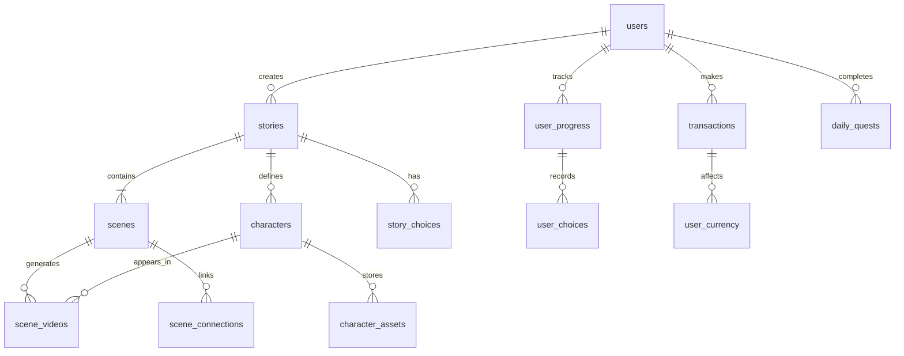

# 📚 Database Schema Documentation

**Стек:** MySQL 8.0+ / MariaDB 10.6+  
**Движок:** InnoDB  
**Кодировка:** utf8mb4_unicode_ci

---

## 🗂️ Общая схема базы данных



---

## 📋 Таблицы

### 1. `users` — Пользователи

| Поле | Тип | Nullable | Default | Описание |
|------|-----|----------|---------|----------|
| `id` | INT UNSIGNED | NO | AUTO_INCREMENT | Primary Key |
| `username` | VARCHAR(50) | NO | - | Уникальный логин |
| `email` | VARCHAR(255) | NO | - | Уникальный email |
| `password_hash` | VARCHAR(255) | NO | - | Хеш пароля (bcrypt/argon2) |
| `role` | ENUM('player', 'author', 'admin') | NO | 'player' | Роль пользователя |
| `is_subscriber` | TINYINT(1) | NO | 0 | Флаг активной подписки |
| `subscription_expires_at` | DATETIME | YES | NULL | Дата окончания подписки |
| `currency_balance` | INT UNSIGNED | NO | 0 | Баланс внутренней валюты |
| `created_at` | TIMESTAMP | NO | CURRENT_TIMESTAMP | Дата регистрации |
| `updated_at` | TIMESTAMP | NO | CURRENT_TIMESTAMP ON UPDATE | Последнее обновление |
| `last_login_at` | DATETIME | YES | NULL | Последний вход |

**Индексы:**
- PRIMARY KEY (`id`)
- UNIQUE (`username`)
- UNIQUE (`email`)
- INDEX (`is_subscriber`, `subscription_expires_at`) — для быстрого поиска подписчиков

---

### 2. `stories` — Истории (проекты авторов)

| Поле | Тип | Nullable | Default | Описание |
|------|-----|----------|---------|----------|
| `id` | INT UNSIGNED | NO | AUTO_INCREMENT | Primary Key |
| `author_id` | INT UNSIGNED | NO | - | Foreign Key → users.id |
| `title` | VARCHAR(255) | NO | - | Название истории |
| `description` | TEXT | YES | NULL | Описание |
| `genre` | VARCHAR(50) | YES | NULL | Жанр (детектив, романтика...) |
| `status` | ENUM('draft', 'rendering', 'published', 'archived') | NO | 'draft' | Статус публикации |
| `cover_image_url` | VARCHAR(500) | YES | NULL | URL обложки |
| `total_plays` | INT UNSIGNED | NO | 0 | Счётчик прохождений |
| `avg_completion_rate` | DECIMAL(5,2) | YES | NULL | Средний % завершения |
| `monetization_score` | DECIMAL(10,2) | YES | NULL | Прогноз доходности (из аналитики) |
| `created_at` | TIMESTAMP | NO | CURRENT_TIMESTAMP | Дата создания |
| `updated_at` | TIMESTAMP | NO | CURRENT_TIMESTAMP ON UPDATE | Последнее обновление |
| `published_at` | DATETIME | YES | NULL | Дата публикации |

**Индексы:**
- PRIMARY KEY (`id`)
- INDEX (`author_id`)
- INDEX (`status`, `published_at`) — для фильтрации опубликованных
- FULLTEXT (`title`, `description`) — для поиска

---

### 3. `characters` — Персонажи (Digital DNA)

| Поле | Тип | Nullable | Default | Описание |
|------|-----|----------|---------|----------|
| `id` | INT UNSIGNED | NO | AUTO_INCREMENT | Primary Key |
| `story_id` | INT UNSIGNED | NO | - | Foreign Key → stories.id |
| `name` | VARCHAR(100) | NO | - | Имя персонажа |
| `description` | TEXT | YES | NULL | Текстовое описание внешности |
| `face_reference_grid` | JSON | YES | NULL | URLs 4-6 референсных изображений |
| `faceid_embedding` | TEXT | YES | NULL | Векторный слепок лица (IP-Adapter) |
| `outfit_prompt_block` | TEXT | YES | NULL | Техническое описание одежды |
| `outfit_color_palette` | JSON | YES | NULL | HEX-коды цветов одежды |
| `current_outfit_var` | VARCHAR(50) | YES | 'casual_look' | Текущая переменная гардероба |
| `loramodel_path` | VARCHAR(500) | YES | NULL | Путь к LoRA модели (для VIP) |
| `similarity_threshold` | DECIMAL(3,2) | NO | 0.75 | Порог проверки сходства |
| `created_at` | TIMESTAMP | NO | CURRENT_TIMESTAMP | Дата создания |

**Индексы:**
- PRIMARY KEY (`id`)
- INDEX (`story_id`)

---

### 4. `character_assets` — Ассеты персонажей (референсы, эмоции)

| Поле | Тип | Nullable | Default | Описание |
|------|-----|----------|---------|----------|
| `id` | INT UNSIGNED | NO | AUTO_INCREMENT | Primary Key |
| `character_id` | INT UNSIGNED | NO | - | Foreign Key → characters.id |
| `asset_type` | ENUM('face_ref', 'emotion_idle', 'emotion_angry', 'emotion_happy', 'emotion_shock', 'outfit_full') | NO | - | Тип ассета |
| `file_url` | VARCHAR(500) | NO | - | URL файла (изображение/видео) |
| `duration_sec` | DECIMAL(5,2) | YES | NULL | Длительность для видео |
| `is_loop` | TINYINT(1) | NO | 0 | Зациклено ли видео |
| `metadata` | JSON | YES | NULL | Доп. данные (ракурс, освещение) |
| `created_at` | TIMESTAMP | NO | CURRENT_TIMESTAMP | Дата загрузки |

**Индексы:**
- PRIMARY KEY (`id`)
- INDEX (`character_id`, `asset_type`)

---

### 5. `scenes` — Сцены истории

| Поле | Тип | Nullable | Default | Описание |
|------|-----|----------|---------|----------|
| `id` | INT UNSIGNED | NO | AUTO_INCREMENT | Primary Key |
| `story_id` | INT UNSIGNED | NO | - | Foreign Key → stories.id |
| `scene_node_id` | VARCHAR(50) | NO | - | Уникальный ID ноды в редакторе (UUID) |
| `title` | VARCHAR(255) | YES | NULL | Название сцены |
| `prompt_base` | TEXT | NO | - | Базовый промпт для генерации |
| `background_prompt` | TEXT | YES | NULL | Промпт фона (если отдельный) |
| `background_url` | VARCHAR(500) | YES | NULL | URL статичного фона |
| `emotion_tag` | VARCHAR(50) | YES | NULL | Тег эмоции для персонажа |
| `motion_bucket` | INT | YES | 50 | Уровень движения (1-255) |
| `is_critical_choice` | TINYINT(1) | NO | 0 | Флаг «эмоционального пика» (100% шанс Variant 3) |
| `sort_order` | INT | NO | 0 | Порядок отображения в редакторе |
| `created_at` | TIMESTAMP | NO | CURRENT_TIMESTAMP | Дата создания |

**Индексы:**
- PRIMARY KEY (`id`)
- INDEX (`story_id`)
- UNIQUE (`story_id`, `scene_node_id`)

---

### 6. `scene_videos` — Сгенерированные видео для сцен

| Поле | Тип | Nullable | Default | Описание |
|------|-----|----------|---------|----------|
| `id` | INT UNSIGNED | NO | AUTO_INCREMENT | Primary Key |
| `scene_id` | INT UNSIGNED | NO | - | Foreign Key → scenes.id |
| `character_id` | INT UNSIGNED | YES | NULL | Foreign Key → characters.id (если есть персонаж) |
| `variant_type` | ENUM('base_1', 'base_2', 'premium_3', 'vip_4') | NO | - | Тип варианта выбора |
| `video_url` | VARCHAR(500) | NO | - | URL видеофайла (S3/R2) |
| `thumbnail_url` | VARCHAR(500) | YES | NULL | URL превью |
| `resolution` | ENUM('480p', '720p', '1080p') | NO | '720p' | Разрешение видео |
| `duration_sec` | DECIMAL(5,2) | NO | 60.0 | Длительность в секундах |
| `generation_status` | ENUM('queued', 'processing', 'completed', 'failed', 'regenerating') | NO | 'queued' | Статус генерации |
| `gpu_worker_id` | VARCHAR(50) | YES | NULL | ID воркера, который рендерил |
| `render_time_sec` | INT | YES | NULL | Фактическое время рендера |
| `similarity_score` | DECIMAL(3,2) | YES | NULL | Оценка сходства лица (0.0-1.0) |
| `file_size_bytes` | BIGINT | YES | NULL | Размер файла |
| `storage_tier` | ENUM('hot', 'warm', 'cold') | NO | 'hot' | Уровень хранения |
| `created_at` | TIMESTAMP | NO | CURRENT_TIMESTAMP | Дата создания |
| `expires_at` | DATETIME | YES | NULL | Дата удаления (для cold storage) |

**Индексы:**
- PRIMARY KEY (`id`)
- INDEX (`scene_id`, `variant_type`)
- INDEX (`generation_status`) — для очереди задач
- INDEX (`storage_tier`, `expires_at`) — для миграции хранения

---

### 7. `scene_connections` — Связи между сценами (граф сюжета)

| Поле | Тип | Nullable | Default | Описание |
|------|-----|----------|---------|----------|
| `id` | INT UNSIGNED | NO | AUTO_INCREMENT | Primary Key |
| `story_id` | INT UNSIGNED | NO | - | Foreign Key → stories.id |
| `from_scene_node_id` | VARCHAR(50) | NO | - | ID исходной сцены |
| `to_scene_node_id` | VARCHAR(50) | NO | - | ID целевой сцены |
| `choice_variant` | TINYINT | NO | - | Номер варианта (1-4) |
| `transition_effect` | VARCHAR(50) | YES | 'crossfade' | Эффект перехода |
| `audio_crossfade_ms` | INT | YES | 500 | Длительность аудио-перехода |

**Индексы:**
- PRIMARY KEY (`id`)
- INDEX (`story_id`, `from_scene_node_id`)

---

### 8. `story_choices` — Конфигурация вариантов выбора

| Поле | Тип | Nullable | Default | Описание |
|------|-----|----------|---------|----------|
| `id` | INT UNSIGNED | NO | AUTO_INCREMENT | Primary Key |
| `scene_id` | INT UNSIGNED | NO | - | Foreign Key → scenes.id |
| `variant_number` | TINYINT | NO | - | Номер (1-4) |
| `button_text` | VARCHAR(100) | NO | - | Текст на кнопке |
| `button_description` | TEXT | YES | NULL | Подсказка при наведении |
| `is_premium` | TINYINT(1) | NO | 0 | Требует оплату/рекламу |
| `price_in_currency` | INT UNSIGNED | YES | NULL | Цена в монетах (для Variant 3) |
| `probability_percent` | DECIMAL(5,2) | YES | NULL | Шанс выпадения (для Variant 3) |
| `vip_only` | TINYINT(1) | NO | 0 | Только для подписчиков (Variant 4) |
| `fallback_scene_node_id` | VARCHAR(50) | YES | NULL | Куда вести при блокировке |

**Индексы:**
- PRIMARY KEY (`id`)
- UNIQUE (`scene_id`, `variant_number`)

---

### 9. `user_progress` — Прогресс игроков

| Поле | Тип | Nullable | Default | Описание |
|------|-----|----------|---------|----------|
| `id` | INT UNSIGNED | NO | AUTO_INCREMENT | Primary Key |
| `user_id` | INT UNSIGNED | NO | - | Foreign Key → users.id |
| `story_id` | INT UNSIGNED | NO | - | Foreign Key → stories.id |
| `current_scene_node_id` | VARCHAR(50) | NO | - | Текущая позиция |
| `visited_scenes` | JSON | YES | NULL | Массив посещённых scene_node_id |
| `total_playtime_sec` | INT UNSIGNED | NO | 0 | Общее время в истории |
| `completion_percentage` | DECIMAL(5,2) | NO | 0.0 | % завершения |
| `endings_unlocked` | JSON | YES | NULL | Массив открытых концовок |
| `last_played_at` | DATETIME | YES | NULL | Последняя сессия |
| `created_at` | TIMESTAMP | NO | CURRENT_TIMESTAMP | Дата начала прохождения |
| `updated_at` | TIMESTAMP | NO | CURRENT_TIMESTAMP ON UPDATE | Последнее обновление |

**Индексы:**
- PRIMARY KEY (`id`)
- UNIQUE (`user_id`, `story_id`) — один прогресс на историю
- INDEX (`user_id`, `last_played_at`)

---

### 10. `user_choices` — История выборов игрока

| Поле | Тип | Nullable | Default | Описание |
|------|-----|----------|---------|----------|
| `id` | INT UNSIGNED | NO | AUTO_INCREMENT | Primary Key |
| `user_progress_id` | INT UNSIGNED | NO | - | Foreign Key → user_progress.id |
| `scene_id` | INT UNSIGNED | NO | - | Foreign Key → scenes.id |
| `chosen_variant` | TINYINT | NO | - | Выбранный вариант (1-4) |
| `payment_method` | ENUM('free', 'currency', 'ad', 'subscription') | YES | NULL | Способ разблокировки |
| `transaction_id` | INT UNSIGNED | YES | NULL | Foreign Key → transactions.id (если оплата) |
| `watched_ad` | TINYINT(1) | NO | 0 | Просмотрел ли рекламу |
| `choice_timestamp` | TIMESTAMP | NO | CURRENT_TIMESTAMP | Время выбора |

**Индексы:**
- PRIMARY KEY (`id`)
- INDEX (`user_progress_id`)
- INDEX (`scene_id`, `chosen_variant`)

---

### 11. `transactions` — Платежи и транзакции

| Поле | Тип | Nullable | Default | Описание |
|------|-----|----------|---------|----------|
| `id` | INT UNSIGNED | NO | AUTO_INCREMENT | Primary Key |
| `user_id` | INT UNSIGNED | NO | - | Foreign Key → users.id |
| `transaction_type` | ENUM('purchase_currency', 'purchase_subscription', 'refund', 'reward', 'quest_bonus') | NO | - | Тип транзакции |
| `amount` | INT | NO | - | Сумма (+ начисление, - списание) |
| `currency_type` | ENUM('coins', 'rub', 'usd') | NO | 'coins' | Тип валюты |
| `payment_provider` | VARCHAR(50) | YES | NULL | ЮKassa/Stripe/Яндекс.Игры |
| `provider_transaction_id` | VARCHAR(255) | YES | NULL | ID у провайдера |
| `status` | ENUM('pending', 'completed', 'failed', 'refunded') | NO | 'pending' | Статус |
| `metadata` | JSON | YES | NULL | Доп. данные (ID товара, ошибка) |
| `created_at` | TIMESTAMP | NO | CURRENT_TIMESTAMP | Дата создания |
| `processed_at` | DATETIME | YES | NULL | Дата обработки |

**Индексы:**
- PRIMARY KEY (`id`)
- INDEX (`user_id`, `status`)
- INDEX (`provider_transaction_id`) — для идемпотентности
- INDEX (`created_at`) — для отчётов

---

### 12. `daily_quests` — Ежедневные задания

| Поле | Тип | Nullable | Default | Описание |
|------|-----|----------|---------|----------|
| `id` | INT UNSIGNED | NO | AUTO_INCREMENT | Primary Key |
| `user_id` | INT UNSIGNED | NO | - | Foreign Key → users.id |
| `quest_type` | ENUM('play_scene', 'watch_ad', 'earn_currency', 'invite_friend') | NO | - | Тип задания |
| `target_value` | INT | NO | - | Требуемое значение |
| `current_value` | INT | NO | 0 | Текущий прогресс |
| `reward_amount` | INT | NO | - | Награда в монетах |
| `is_completed` | TINYINT(1) | NO | 0 | Выполнено ли |
| `is_claimed` | TINYINT(1) | NO | 0 | Забрана ли награда |
| `resets_at` | DATETIME | NO | - | Дата сброса (след. день) |
| `created_at` | TIMESTAMP | NO | CURRENT_TIMESTAMP | Дата создания |

**Индексы:**
- PRIMARY KEY (`id`)
- INDEX (`user_id`, `resets_at`)
- INDEX (`is_completed`, `is_claimed`)

---

### 13. `render_queue` — Очередь рендеринга

| Поле | Тип | Nullable | Default | Описание |
|------|-----|----------|---------|----------|
| `id` | INT UNSIGNED | NO | AUTO_INCREMENT | Primary Key |
| `scene_video_id` | INT UNSIGNED | NO | - | Foreign Key → scene_videos.id |
| `priority` | TINYINT | NO | 1 | Приоритет (1=free, 5=premium, 10=vip) |
| `status` | ENUM('queued', 'assigned', 'processing', 'completed', 'failed') | NO | 'queued' | Статус задачи |
| `worker_id` | VARCHAR(50) | YES | NULL | ID назначенного воркера |
| `retry_count` | TINYINT | NO | 0 | Количество попыток |
| `error_message` | TEXT | YES | NULL | Текст ошибки (при failed) |
| `payload_json` | JSON | NO | - | Полные параметры генерации |
| `queued_at` | TIMESTAMP | NO | CURRENT_TIMESTAMP | Время постановки |
| `started_at` | DATETIME | YES | NULL | Время начала |
| `completed_at` | DATETIME | YES | NULL | Время завершения |

**Индексы:**
- PRIMARY KEY (`id`)
- INDEX (`status`, `priority`, `queued_at`) — для выборки задач
- INDEX (`worker_id`)

---

### 14. `analytics_events` — События аналитики

| Поле | Тип | Nullable | Default | Описание |
|------|-----|----------|---------|----------|
| `id` | BIGINT UNSIGNED | NO | AUTO_INCREMENT | Primary Key |
| `user_id` | INT UNSIGNED | YES | NULL | Foreign Key → users.id (NULL для анонимов) |
| `event_type` | VARCHAR(50) | NO | - | Тип: scene_complete, choice_made, ad_watched... |
| `story_id` | INT UNSIGNED | YES | NULL | Foreign Key → stories.id |
| `scene_id` | INT UNSIGNED | YES | NULL | Foreign Key → scenes.id |
| `event_data` | JSON | YES | NULL | Контекст события |
| `session_id` | VARCHAR(100) | YES | NULL | ID сессии |
| `ip_address` | VARBINARY(16) | YES | NULL | IP адрес (INET6_ATON) |
| `user_agent` | VARCHAR(500) | YES | NULL | User-Agent браузера |
| `created_at` | TIMESTAMP | NO | CURRENT_TIMESTAMP | Время события |

**Индексы:**
- PRIMARY KEY (`id`)
- INDEX (`event_type`, `created_at`)
- INDEX (`story_id`, `event_type`)
- INDEX (`user_id`, `created_at`)

> 💡 **Оптимизация:** Для high-load систем эту таблицу лучше вынести в отдельную БД или использовать ClickHouse/TimescaleDB.

---

### 15. `system_settings` — Глобальные настройки

| Поле | Тип | Nullable | Default | Описание |
|------|-----|----------|---------|----------|
| `setting_key` | VARCHAR(100) | NO | - | Primary Key |
| `setting_value` | TEXT | YES | NULL | Значение (JSON/скаляр) |
| `description` | VARCHAR(255) | YES | NULL | Описание настройки |
| `updated_at` | TIMESTAMP | NO | CURRENT_TIMESTAMP ON UPDATE | Последнее изменение |

**Примеры данных:**
```sql
INSERT INTO system_settings (setting_key, setting_value, description) VALUES
('currency_name', 'coins', 'Название внутренней валюты'),
('price_variant3', '100', 'Цена третьего варианта по умолчанию'),
('subscription_monthly_price', '4.99', 'Цена месячной подписки'),
('ad_reward_amount', '50', 'Награда за просмотр рекламы'),
('face_consistency_threshold', '0.75', 'Порог проверки сходства лиц'),
('maintenance_mode', 'false', 'Режим обслуживания');
```

---

## 🔧 Миграции и версии

### Таблица `schema_migrations`

| Поле | Тип | Описание |
|------|-----|----------|
| `version` | VARCHAR(50) | Primary Key, номер миграции |
| `applied_at` | TIMESTAMP | Дата применения |

**Пример:**
```sql
CREATE TABLE schema_migrations (
    version VARCHAR(50) PRIMARY KEY,
    applied_at TIMESTAMP DEFAULT CURRENT_TIMESTAMP
);
```

---

## 📊 Представления (Views)

### `v_story_analytics` — Аналитика по историям

```sql
CREATE VIEW v_story_analytics AS
SELECT 
    s.id AS story_id,
    s.title,
    COUNT(DISTINCT up.user_id) AS total_players,
    AVG(up.completion_percentage) AS avg_completion,
    COUNT(DISTINCT uc.id) AS total_choices,
    SUM(CASE WHEN uc.chosen_variant = 3 THEN 1 ELSE 0 END) AS variant3_choices,
    SUM(CASE WHEN uc.chosen_variant = 4 THEN 1 ELSE 0 END) AS variant4_choices,
    SUM(CASE WHEN uc.payment_method = 'ad' THEN 1 ELSE 0 END) AS ad_views
FROM stories s
LEFT JOIN user_progress up ON s.id = up.story_id
LEFT JOIN user_choices uc ON up.id = uc.user_progress_id
WHERE s.status = 'published'
GROUP BY s.id;
```

### `v_user_dashboard` — Дашборд пользователя

```sql
CREATE VIEW v_user_dashboard AS
SELECT 
    u.id,
    u.username,
    u.currency_balance,
    u.is_subscriber,
    u.subscription_expires_at,
    COUNT(DISTINCT up.story_id) AS stories_in_progress,
    COALESCE(SUM(t.amount), 0) AS total_currency_spent,
    (SELECT COUNT(*) FROM daily_quests dq 
     WHERE dq.user_id = u.id AND dq.is_completed = 1 AND dq.is_claimed = 0) AS unclaimed_rewards
FROM users u
LEFT JOIN user_progress up ON u.id = up.user_id
LEFT JOIN transactions t ON u.id = t.user_id AND t.transaction_type IN ('purchase_currency', 'reward')
GROUP BY u.id;
```

---

## 🔐 Безопасность и доступ

### Ролевая модель (для будущего расширения)

```sql
CREATE TABLE roles (
    id INT PRIMARY KEY AUTO_INCREMENT,
    role_name VARCHAR(50) UNIQUE NOT NULL,
    permissions JSON NOT NULL
);

CREATE TABLE user_roles (
    user_id INT UNSIGNED NOT NULL,
    role_id INT NOT NULL,
    granted_at TIMESTAMP DEFAULT CURRENT_TIMESTAMP,
    PRIMARY KEY (user_id, role_id),
    FOREIGN KEY (user_id) REFERENCES users(id) ON DELETE CASCADE,
    FOREIGN KEY (role_id) REFERENCES roles(id) ON DELETE CASCADE
);
```

---

## 📈 Индексация для производительности

### Критические индексы для MVP

1. **Поиск историй:**
   ```sql
   CREATE INDEX idx_stories_published ON stories(status, published_at DESC);
   ```

2. **Очередь рендеринга:**
   ```sql
   CREATE INDEX idx_render_queue_priority ON render_queue(priority ASC, queued_at ASC) 
   WHERE status = 'queued';
   ```

3. **Прогресс игрока:**
   ```sql
   CREATE UNIQUE INDEX idx_user_story_progress ON user_progress(user_id, story_id);
   ```

4. **Аналитика по событиям:**
   ```sql
   CREATE INDEX idx_analytics_events_lookup ON analytics_events(event_type, created_at DESC);
   ```

---

## 🔄 Триггеры (опционально)

### Авто-обновление `updated_at`

```sql
DELIMITER $$
CREATE TRIGGER trg_users_updated_at 
BEFORE UPDATE ON users
FOR EACH ROW
BEGIN
    SET NEW.updated_at = CURRENT_TIMESTAMP;
END$$
DELIMITER ;
```

### Обновление баланса после транзакции

```sql
DELIMITER $$
CREATE TRIGGER trg_transaction_completed
AFTER INSERT ON transactions
FOR EACH ROW
BEGIN
    IF NEW.status = 'completed' AND NEW.currency_type = 'coins' THEN
        UPDATE users 
        SET currency_balance = currency_balance + NEW.amount
        WHERE id = NEW.user_id;
    END IF;
END$$
DELIMITER ;
```

---

## 📦 Резервное копирование

### Стратегия бэкапов

| Тип | Частота | Хранение | Что включать |
|-----|---------|----------|--------------|
| **Полный** | Еженедельно | S3 Cold (Glacier) | Все таблицы |
| **Дифференциальный** | Ежедневно | S3 Warm | Изменения за сутки |
| **Бинарные логи** | Непрерывно | Локально + S3 | Для point-in-time recovery |

### Команда для бэкапа

```bash
mysqldump --single-transaction --routines --triggers \
  -u backup_user -p ai_story_db | gzip > backup_$(date +%Y%m%d_%H%M%S).sql.gz
```

---

## 🎯 Рекомендации по оптимизации

1. **Partitioning для `analytics_events`:**
   ```sql
   ALTER TABLE analytics_events 
   PARTITION BY RANGE (YEAR(created_at)) (
       PARTITION p2024 VALUES LESS THAN (2025),
       PARTITION p2025 VALUES LESS THAN (2026)
   );
   ```

2. **Архивация старых данных:**
   - Перемещать `user_choices` старше 90 дней в `user_choices_archive`
   - Перемещать `analytics_events` старше 30 дней в холодное хранилище

3. **Кэширование:**
   - Redis для сессий пользователей
   - Redis для популярных историй (топ-100)
   - Query cache для `v_story_analytics`

---

*Документация актуальна для версии схемы 1.0 (MVP)*
