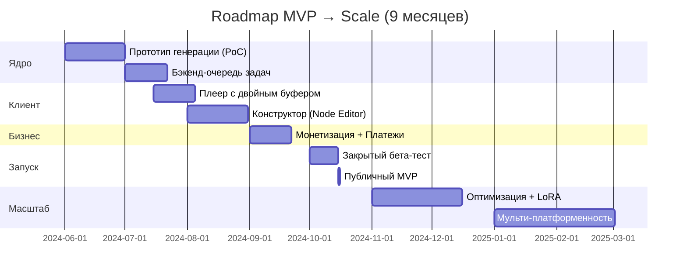

# 🗺️ ROADMAP: AI Interactive Story Platform

Ниже представлен детализированный план разработки, разбитый на логические фазы. Учитывая ваш бэкграунд (1C, full-stack), я сделал акцент на **технических зависимостях** и **критических путях**, чтобы вы могли сразу оценить риски и ресурсы.

---

## 📊 Обзорная диаграмма (Гантт-лайт)



---

## 🚀 ФАЗА 0: Pre-Production (2 недели)
**Цель:** Снизить технические риски до написания кода.

| Задача | Описание | Критерий готовности | Приоритет |
|--------|----------|---------------------|-----------|
| **Тех-спайк: Консистентность** | Протестировать связку `IP-Adapter + AnimateDiff` на предмет удержания лица (5+ сцен) | Лицо не «плывёт», метрика similarity > 0.75 | 🔴 Critical |
| **Выбор стека инфраструктуры** | Сравнить: RunPod vs Vast.ai vs собственный сервер. Зафиксировать провайдера. | Документ с расчётом $/мин рендера | 🔴 Critical |
| **Прототип очереди задач** | Минимальная реализация: Redis + Celery/BullMQ, один воркер. | Задача создаётся → выполняется → результат в S3 | 🔴 Critical |
| **Дизайн-система UI** | Макеты плеера, кнопок выбора, состояний (loading, error, vip). | Figma-файл с компонентами и состояниями | 🟡 High |

> 💡 **Совет:** Не начинайте фронтенд, пока не подтвердите, что нейросеть выдаёт предсказуемый результат. Это главный риск проекта.

---

## 🧱 ФАЗА 1: MVP Core (Месяцы 1-3)
**Цель:** Рабочий продукт, где автор создаёт историю, а игрок проходит её с базовой монетизацией.

### Спринт 1-2: Бэкенд-ядро
```yaml
Генерация контента:
  - [ ] API-обёртка над Stable Diffusion/AnimateDiff
  - [ ] Модуль "Character DNA": сохранение FaceID-эмбеддингов
  - [ ] Система промпт-инжекции (автоматическое добавление тегов одежды/локации)

Очереди и хранение:
  - [ ] Redis очередей с приоритетами (free/premium/vip)
  - [ ] Интеграция с S3-совместимым хранилищем (Cloudflare R2 / MinIO)
  - [ ] Webhook-уведомления о завершении рендера
```

### Спринт 3-4: Клиентский плеер
```yaml
Видео-движок:
  - [ ] Реализация "двойного буфера" (Player A/B) для бесшовной склейки
  - [ ] HLS-стриминг с авто-переключением качества (360p/720p)
  - [ ] Preloading: приоритетная загрузка вариантов 1 и 2

Интерфейс выбора:
  - [ ] Оверлей с 4 кнопками, контекстные подсказки
  - [ ] Логика отображения: блокировка Variant 4 для не-подписчиков
  - [ ] Анимации переходов (crossfade аудио, визуальные эффекты)
```

### Спринт 5-6: Конструктор (MVP-версия)
```yaml
Редактор сцен:
  - [ ] Drag-and-drop интерфейс для создания нод (библиотека: React Flow / Vue Flow)
  - [ ] Базовые поля: промпт, выбор эмоций, привязка персонажа
  - [ ] Экспорт сценария в JSON-структуру

Простая валидация:
  - [ ] Проверка на «висячие» ноды (без исходящих связей)
  - [ ] Предпросмотр: генерация 3-секундного превью вместо полного видео
```

### 🎯 Релиз Alpha (конец 3-го месяца)
- **Доступно:** Внутренняя команда + 5-10 доверенных авторов.
- **Функционал:** Создание истории → рендер → прохождение с выбором.
- **Монетизация:** Заглушки (кнопки есть, платежи не подключены).
- **Метрики успеха:** 
  - Время от клика «Рендер» до готовности видео < 3 мин (720p).
  - Консистентность лица в 80%+ сцен.
  - Плеер не «лагает» при переключении сцен на 4G.

---

## 💰 ФАЗА 2: Monetization & Polish (Месяцы 4-5)
**Цель:** Включить экономику, подготовить к публичному запуску.

| Модуль | Задачи | Зависимости |
|--------|--------|-------------|
| **Платежи** | Интеграция ЮKassa / Stripe / Яндекс.Игры. Вебхуки, идемпотентность, возвраты. | Готовая система пользовательских профилей |
| **Реклама** | Rewarded Video за Вариант 3. SDK: Яндекс.Игры, Unity Ads. Fallback при отсутствии сети. | Реализованная логика «11% шанса» |
| **Подписка** | Управление статусом `is_subscriber`, активация Варианта 4, кэшбек-механика. | Платёжный шлюз + флаг-система на бэкенде |
| **Аналитика** | События: `scene_complete`, `choice_made`, `ad_watched`. Дашборд для автора. | Сбор метрик на клиенте + агрегатор на бэке |
| **Безопасность** | Обфускация JS, шифрование `story.json`, integrity check при старте. | Готовый Project Bundler |

### 🎯 Релиз Beta (конец 5-го месяца)
- **Доступно:** Закрытый тест на 100-500 пользователей (по инвайтам).
- **Функционал:** Полная монетизация, аналитика, базовая защита.
- **Метрики успеха:**
  - Конверсия в просмотр рекламы: >25%.
  - Конверсия в подписку (из демо): >3%.
  - Отсутствие критических багов при оплате (0% failed transactions).

---

## 🌍 ФАЗА 3: Public Launch & Growth (Месяцы 6-9)
**Цель:** Масштабирование, оптимизация затрат, расширение контента.

### Техническая оптимизация
```yaml
Рендер-ферма:
  - [ ] Авто-скейлинг воркеров на основе длины очереди (Kubernetes HPA)
  - [ ] Внедрение LoRA-моделей для топовых персонажей (снижение дрейфа лица)
  - [ ] Кэширование одинаковых промптов (deduplication queue)

Клиент:
  - [ ] PWA-режим: офлайн-доступ к уже загруженным сценам
  - [ ] Lite Mode: автоматическое переключение на 480p для слабых устройств
  - [ ] Accessibility: скринридеры, субтитры, высокий контраст
```

### Расширение функционала
```yaml
Для авторов:
  - [ ] AI Copilot: авто-расширение промптов, проверка на конфликты
  - [ ] Тепловая карта монетизации в редакторе
  - [ ] Шаблоны жанров (детектив, романтика, хоррор)

Для игроков:
  - [ ] Мини-игры для фарма валюты (Phaser.js)
  - [ ] Система ежедневных квестов и прогресс-баров
  - [ ] Социальные фичи: рефералка, шаринг моментов
```

### 🎯 Релиз Public MVP (месяц 6)
- **Доступно:** Открытая регистрация, маркетинговый запуск.
- **Метрики успеха:**
  - Стабильная работа при 1000+ DAU.
  - LTV > CAC (юнит-экономика сходится).
  - Среднее время сессии > 8 минут.

---

## 📈 ФАЗА 4: Scale & Ecosystem (Месяцы 10+)
**Цель:** Превращение в платформу, выход на новые рынки.

| Направление | Инициативы | Ожидаемый эффект |
|-------------|------------|------------------|
| **Мульти-платформенность** | Экспорт в мобильные приложения (Capacitor / React Native), VK Mini Apps | +40-60% охвата аудитории |
| **AI-улучшения** | Интеграция новых моделей (SVD-XT, Kling), авто-озвучка (ElevenLabs), липсинк | Качество контента уровня «премиум» |
| **Маркетплейс ассетов** | Авторы могут продавать/покупать пресеты персонажей, локатий, стилей | Сетевой эффект, рост UGC |
| **B2B-инструменты** | Белый лейбл для образовательных/корпоративных сценариев | Новый канал монетизации |

---

## 🔑 Критические зависимости и риски

```yaml
Блокеры:
  1. Качество генерации видео: если консистентность <70% — продукт не взлетит.
     → Митигация: заложить +2 недели на спайки, иметь fallback на статичные кадры.
  
  2. Стоимость GPU: рост цен может убить маржинальность.
     → Митигация: мульти-провайдер стратегия, кэширование, ночные тарифы.
  
  3. Модерация платформ: Яндекс.Игры / VK могут отклонить из-за AI-контента.
     → Митигация: пре-модерация промптов, чеклист перед паблишем, диалог с модераторами заранее.

Ресурсы (минимальная команда для MVP):
  - Backend: 1-2 чел. (Python/Node.js, очереди, AI-API)
  - Frontend: 1-2 чел. (React/Vue, WebGL/Canvas, плеер)
  - DevOps: 0.5 чел. (инфраструктура, деплой, мониторинг)
  - QA: 0.5 чел. (автотесты, ручное тестирование сценариев)
  - AI-инженер: 1 чел. (настройка пайплайнов генерации, тонкая настройка моделей)
```

---

## 📋 Чеклист готовности к каждой фазе

### ✅ Перед стартом Фазы 1
- [ ] Покрыты риски по качеству генерации (есть рабочий прототип)
- [ ] Выбраны и протестированы инфраструктурные провайдеры
- [ ] Утверждён дизайн-система и пользовательские сценарии

### ✅ Перед стартом Фазы 2
- [ ] Пройдено внутреннее тестирование (0 критических багов)
- [ ] Настроена аналитика (сбор метрик работает)
- [ ] Подготовлены юридические документы (оферта, политика конфиденциальности)

### ✅ Перед публичным запуском (Фаза 3)
- [ ] Нагрузочное тестирование: система держит 2-3× от плановой нагрузки
- [ ] Подготовлен план реагирования на инциденты (on-call, алерты)
- [ ] Есть «горячий» контент: 3-5 готовых историй для запуска

---

> 💡 **Рекомендация по приоритизации**:  
> Если ресурсы ограничены — сфокусируйтесь на **Ядре генерации + Плеере**. Конструктор можно временно заменить на ручное редактирование JSON, а монетизацию — на заглушки. Главное — доказать, что игроки хотят смотреть и взаимодействовать с таким форматом.

---

Нужно ли детализировать какой-то конкретный этап? Например:
- Расписать технические задачи для спринта в формате Jira/YouTrack?
- Подготовить шаблон «Definition of Done» для каждой фичи?
- Сделать упрощённую версию роадмапа для презентации инвесторам?

Готов помочь с любым из вариантов. 🛠️
